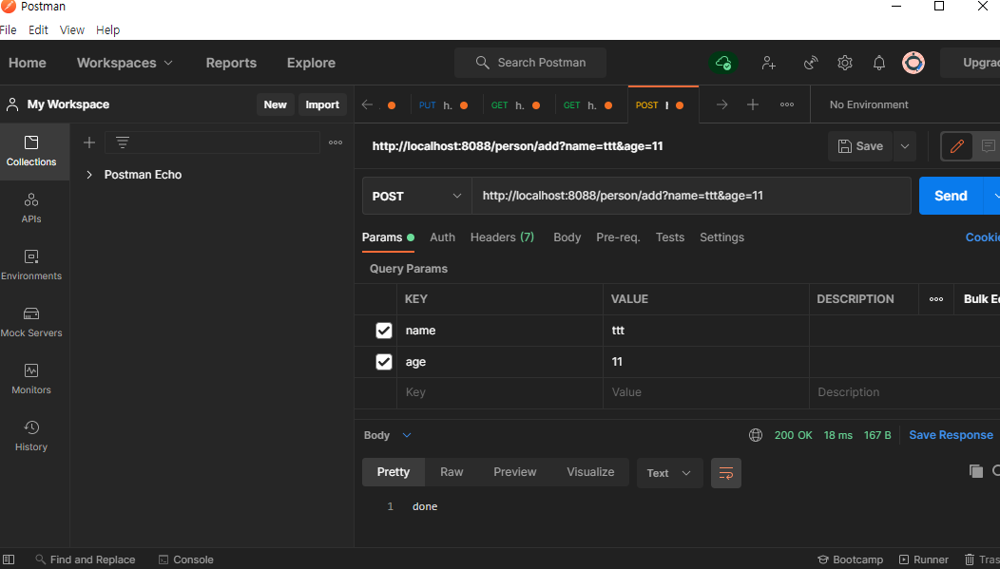

# 개요
* 스프링부트 요청 파라미터를 객체로 수신

<br>

# 상세내용
## 요청 파라미터를 전달 받을 객체 정의
```java
@Setter
@Getter
public class demoDTO {

    private String name;
    private int age;
}
```

## 컨트롤러 정의
* 파라미터에 요청 파라미터를 받을 객체를 사용
```java
public class Controller {
    @PostMapping("/add")
    public String list(demoDTO dto){
        log.info("이름" + dto.getName());
        log.info("나이" + dto.getAge());

        // 회원가입 로직

        return "done";
    }
}

```

<br>

# 실행결과

